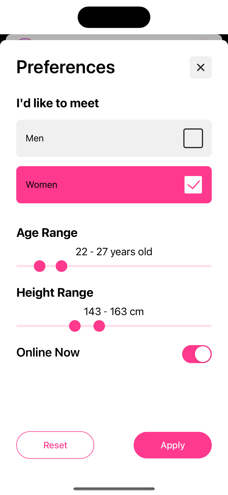
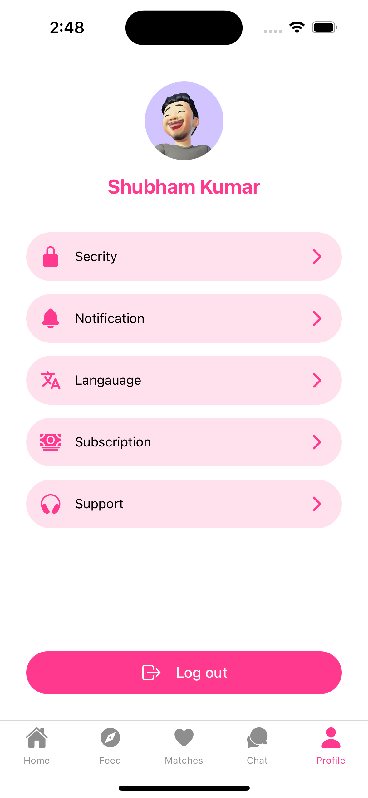

# Clover Dating App using React Native

Welcome to the Clover Dating App project, a platform built with React Native designed to connect users with potential matches based on their preferences and location. This app offers a seamless native-like experience across both Android and iOS devices.

## Getting Started

Follow these steps to set up the project on your local machine.

### Prerequisites

- Node.js installed
- npm or Yarn
- Android Studio or Xcode for running the app on an emulator/simulator

### Installation

1. **Clone the repository**

```bash
git clone https://github.com/theshubhamy/clover.git
cd clover
```

### Step 2: Install dependencies

```bash
npm install
# or
yarn install
```

### Step 3: Start Metro Server

Start the Metro bundler in the root of your project:

```bash
npm start
# or
yarn start
```

### Step 4: Run on Android or iOS

#### For Android

```bash
npm run android
# or
yarn android
```

#### For iOS

```bash
npm run ios
# or
yarn ios
```

Ensure you have set up your Android Emulator or iOS Simulator correctly.

## Project Description Summary

This app aims to provide a platform for users to discover and connect with potential dating partners nearby. It leverages React Native to offer a native-like experience on both Android and iOS platforms.

## Features

- **User Authentication**: Allow users to sign up, log in, and manage their profiles securely.
- **Matching Algorithm**: Implement a matching system based on user preferences and location.
- **Chat Messaging**: Enable real-time messaging between matched users.
- **Profile Management**: Users can edit their profiles, add photos, and update preferences.
- **Location-Based Matching**: Utilize geolocation to suggest matches based on proximity.
- **Push Notifications**: Notify users about new matches, messages, and app updates.

## Screen Snapshots

Here are some snapshots of the app screens:

<table>
  <tr>
	<td></td>
	<td></td>
	<td></td>
	<td></td>
  </tr>
  <tr>
		<td></td>
		 <td></td>
    <td></td>
   <!-- Empty cell for alignment -->
  </tr>
</table>

## Troubleshooting

If you encounter issues running the app, refer to the [React Native troubleshooting guide](https://reactnative.dev/docs/troubleshooting).

## Learn More

For more details on React Native, visit the [React Native documentation](https://reactnative.dev/docs/getting-started).

Happy coding! 🚀
